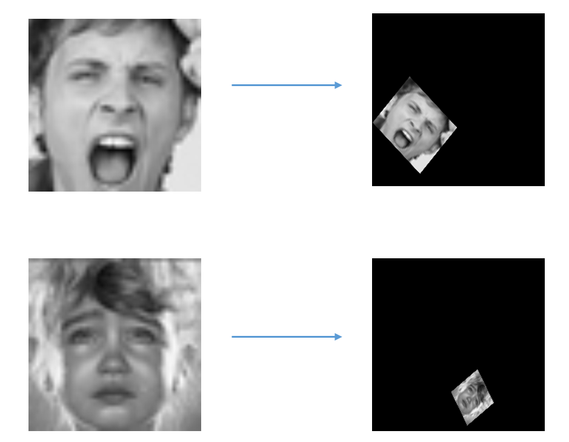
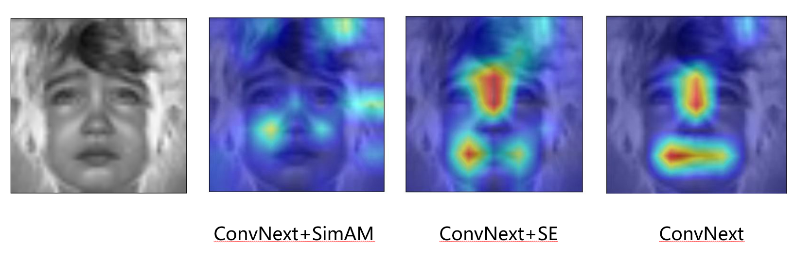
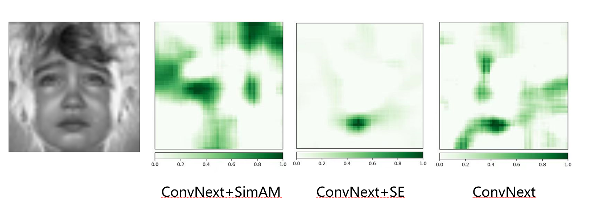

# **面部情绪识别的可解释性深度学习算法**

训练好的模型参数权重可以从百度网盘下载： [链接](https://pan.baidu.com/s/1t_mqXIqXZuiKr80xCO9R-Q?pwd=7rto ) 提取码：7rto

运行算法前，需要安装下面的依赖

```
captum==0.7.0
grad-cam==1.5.2
matplotlib
numpy
pillow
pandas
torch
torchvision
tqdm
```

## 运行代码

训练/评估模型

```
python main.py [-h] [--batch_size BATCH_SIZE] [--num_epochs NUM_EPOCHS] [--lr LR] [--use_se] [--use_sim] [--use_stn]
               [--ckpt CKPT]

options:
  -h, --help              show this help message and exit
  --batch_size BATCH_SIZE set the batch size
  --num_epochs NUM_EPOCHS set the number of epochs
  --lr LR                 set the learning rate, 1e-4 default     
  --use_se                use SE layer
  --use_sim               use SimAM Module
  --use_stn               use STN Module
  --ckpt CKPT             load checkpoint {CKPT}
```

例如，

```
python main.py --batch_size 64 --num_epochs 20 --ckpt best_model_xlarge_se.pth --use_se
```


可视化模型结果

```
python visual.py [-h] [--use_se] [--use_sim] [--use_stn] [--ckpt CKPT] [--input INPUT] [--label LABEL]

options:
  -h, --help     show this help message and exit
  --use_se       use SE layer
  --use_sim      use SimAM Module
  --use_stn      use STN Module
  --ckpt CKPT    load checkpoint {CKPT}
  --input INPUT  set the input image path {INPUT}
  --label LABEL  set the input image label {LABEL}
```

例如

```
python visual.py --ckpt best_model_xlarge_se.pth --use_se --input im52.png --label sad
```

## 结果展示







# Interpretable Facial Emotion Recognition Learning

Pretrained Models: [link](https://pan.baidu.com/s/1t_mqXIqXZuiKr80xCO9R-Q?pwd=7rto ) password: 7rto

To run our code, you need to install the following requirements first:

```
captum==0.7.0
grad-cam==1.5.2
matplotlib
numpy
pillow
pandas
torch
torchvision
tqdm
```

## Usage

Run/Evaluate the model:

```
python main.py [-h] [--batch_size BATCH_SIZE] [--num_epochs NUM_EPOCHS] [--lr LR] [--use_se] [--use_sim] [--use_stn]
               [--ckpt CKPT]

options:
  -h, --help              show this help message and exit
  --batch_size BATCH_SIZE set the batch size
  --num_epochs NUM_EPOCHS set the number of epochs
  --lr LR                 set the learning rate, 1e-4 default     
  --use_se                use SE layer
  --use_sim               use SimAM Module
  --use_stn               use STN Module
  --ckpt CKPT             load checkpoint {CKPT}
```

e.g.

```
python main.py --batch_size 64 --num_epochs 20 --ckpt best_model_xlarge_se.pth --use_se
```

Visualize the model results

```
python visual.py [-h] [--use_se] [--use_sim] [--use_stn] [--ckpt CKPT] [--input INPUT] [--label LABEL]

options:
  -h, --help     show this help message and exit
  --use_se       use SE layer
  --use_sim      use SimAM Module
  --use_stn      use STN Module
  --ckpt CKPT    load checkpoint {CKPT}
  --input INPUT  set the input image path {INPUT}
  --label LABEL  set the input image label {LABEL}
```

e.g.

```
python visual.py --ckpt best_model_xlarge_se.pth --use_se --input im52.png --label sad
```

## Results


